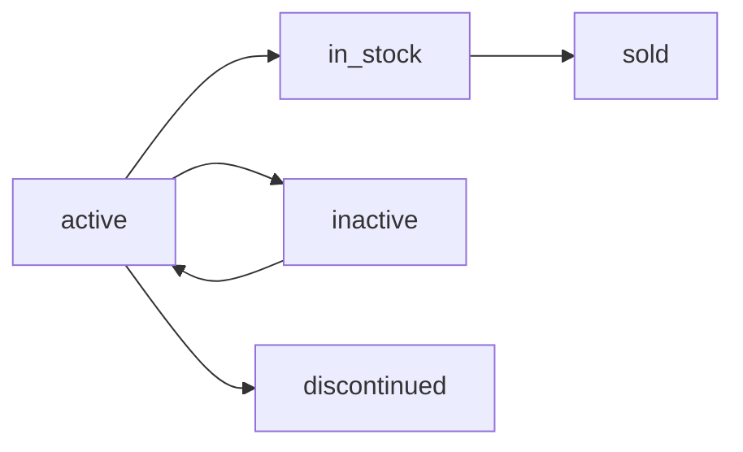

# Product API Documentation

## Overview
The Product API manages products and their stock information in the Dr. Mobile POS system. This API handles product creation, inventory management, and stock tracking with integrated transaction support.

## Base URL
```
http://localhost:3000/api/products
```

---

## Table of Contents
- [Models](#models)
  - [Product Model](#product-model)
  - [Product Stock Model](#product-stock-model)
  - [Stock Issues Model](#stock-issues-model)
- [Endpoints](#endpoints)
  - [Create Product](#create-product)
- [Error Handling](#error-handling)
- [Examples](#examples)

---

## Models

### Product Model
The main product entity containing product details and specifications.

**Table Name:** `products`

| Field | Type | Required | Unique | Description |
|-------|------|----------|--------|-------------|
| `id` | STRING | Yes | Yes (PK) | Auto-generated product ID (format: PROD-XXXXX) |
| `productName` | STRING | Yes | No | Name of the product |
| `description` | TEXT | No | No | Detailed product description |
| `price` | DECIMAL(10,2) | Yes | No | Product price |
| `brand` | STRING | Yes | No | Product brand name |
| `model` | STRING | No | No | Product model number |
| `color` | STRING | No | No | Product color |
| `capacity` | STRING | No | No | Storage capacity (e.g., "128GB") |
| `condition` | STRING | No | No | Product condition (e.g., "New", "Refurbished") |
| `warrenty` | STRING | No | No | Warranty information |
| `IMEI` | STRING | No | Yes | International Mobile Equipment Identity number |
| `barcode` | STRING | No | Yes | Product barcode |
| `serialNumber` | STRING | No | Yes | Product serial number |
| `createdAt` | TIMESTAMP | Auto | No | Record creation timestamp |
| `updatedAt` | TIMESTAMP | Auto | No | Last update timestamp |

**Relationships:**
- One-to-One with Product_Stock (has one Product_Stock)

---

### Product Stock Model
Manages inventory, pricing, and stock status for products.

**Table Name:** `Product_Stock`

| Field | Type | Required | Unique | Description |
|-------|------|----------|--------|-------------|
| `id` | INTEGER | Auto | Yes (PK) | Auto-increment primary key |
| `product_id` | STRING | Yes | No (FK) | Reference to Product.id |
| `sku` | STRING | Yes | Yes | Stock Keeping Unit |
| `cost_price` | DECIMAL(10,2) | Yes | No | Cost price of the product |
| `selling_price` | DECIMAL(10,2) | Yes | No | Selling price of the product |
| `profit_margin` | DECIMAL(5,2) | No | No | Profit margin percentage |
| `supplier` | STRING | No | No | Supplier name |
| `minimum_stock_level` | INTEGER | No | No | Minimum stock threshold |
| `storage_location` | STRING | No | No | Physical storage location |
| `date_added` | DATE | No | No | Date when stock was added (defaults to NOW) |
| `status` | ENUM | Yes | No | Stock status |
| `createdAt` | TIMESTAMP | Auto | No | Record creation timestamp |
| `updatedAt` | TIMESTAMP | Auto | No | Last update timestamp |

**Status Enum Values:**
- `active` - Product is active in inventory (default)
- `inactive` - Product is temporarily inactive
- `discontinued` - Product is discontinued
- `in_stock` - Product is available in stock
- `sold` - Product has been sold

**Relationships:**
- Belongs-To Product (via product_id)

**Cascade Behavior:**
- ON UPDATE CASCADE
- ON DELETE CASCADE

---

### Stock Issues Model
Tracks stock issuance and sales transactions.

**Table Name:** `Stock_Issues`

| Field | Type | Required | Unique | Description |
|-------|------|----------|--------|-------------|
| `id` | INTEGER | Auto | Yes (PK) | Auto-increment primary key |
| `product_id` | STRING | Yes | No (FK) | Reference to Product.id |
| `issued_to` | STRING | Yes | No | Customer/recipient name |
| `issued_date` | DATE | Yes | No | Date of issuance (defaults to NOW) |
| `status` | ENUM | Yes | No | Issue status |
| `createdAt` | TIMESTAMP | Auto | No | Record creation timestamp |
| `updatedAt` | TIMESTAMP | Auto | No | Last update timestamp |

**Status Enum Values:**
- `pending_payment` - Awaiting payment
- `sold` - Transaction completed

**Cascade Behavior:**
- ON UPDATE CASCADE
- ON DELETE CASCADE

---

## Endpoints

### Create Product

Creates a new product along with its stock information in a single transaction.

**Endpoint:** `POST /api/products`

**Content-Type:** `application/json`

**Description:** Creates both a Product and Product_Stock entry atomically using database transactions. If any part fails, the entire operation is rolled back.

#### Request Body

```json
{
  // Product Information
  "productName": "string (required)",
  "description": "string (optional)",
  "price": "number (required)",
  "brand": "string (required)",
  "model": "string (optional)",
  "color": "string (optional)",
  "capacity": "string (optional)",
  "condition": "string (optional)",
  "warrenty": "string (optional)",
  "IMEI": "string (optional, unique)",
  "barcode": "string (optional, unique)",
  "serialNumber": "string (optional, unique)",
  
  // Stock Information
  "sku": "string (required, unique)",
  "cost_price": "number (required)",
  "selling_price": "number (required)",
  "profit_margin": "number (optional)",
  "supplier": "string (optional)",
  "minimum_stock_level": "integer (optional)",
  "storage_location": "string (optional)",
  "date_added": "date (optional, defaults to current date)",
  "status": "enum (optional, defaults to 'active')"
}
```

#### Status Field Options
- `active`
- `inactive`
- `discontinued`
- `in_stock`
- `sold`

#### Success Response

**Status Code:** `201 Created`

```json
{
  "success": true,
  "message": "Product created successfully",
  "newProduct": {
    "id": "PROD-00001",
    "productName": "iPhone 15 Pro Max",
    "description": "Latest flagship iPhone",
    "price": "1199.99",
    "brand": "Apple",
    "model": "A2849",
    "color": "Natural Titanium",
    "capacity": "256GB",
    "condition": "New",
    "warrenty": "1 Year Apple Warranty",
    "IMEI": "359876543210987",
    "barcode": "EAN13-00001",
    "serialNumber": "ABCD-1234-EFGH",
    "createdAt": "2026-02-27T10:30:00.000Z",
    "updatedAt": "2026-02-27T10:30:00.000Z"
  },
  "productStock": {
    "id": 1,
    "product_id": "PROD-00001",
    "sku": "IPH15PM-256-NTT",
    "cost_price": "999.00",
    "selling_price": "1199.99",
    "profit_margin": "20.08",
    "supplier": "Apple Inc.",
    "minimum_stock_level": 5,
    "storage_location": "Warehouse A - Shelf 12",
    "date_added": "2026-02-27T00:00:00.000Z",
    "status": "in_stock",
    "createdAt": "2026-02-27T10:30:00.000Z",
    "updatedAt": "2026-02-27T10:30:00.000Z"
  }
}
```

#### Error Response

**Status Code:** `500 Internal Server Error`

```json
{
  "success": false,
  "message": "Error creating product",
  "error": "Detailed error message"
}
```

**Common Error Scenarios:**
- Duplicate `IMEI`, `barcode`, or `serialNumber` in Product table
- Duplicate `sku` in Product_Stock table
- Missing required fields
- Invalid data types
- Database connection issues
- Transaction rollback failures

---

## Error Handling

The API uses database transactions to ensure data consistency. If any part of the product creation fails (either Product or Product_Stock), the entire transaction is rolled back, ensuring no partial data is saved.

### Error Response Structure

```json
{
  "success": false,
  "message": "Brief error description",
  "error": "Detailed error message from the system"
}
```

### Common HTTP Status Codes

| Code | Description |
|------|-------------|
| `201` | Created - Resource successfully created |
| `400` | Bad Request - Invalid input data |
| `409` | Conflict - Duplicate unique field (IMEI, SKU, etc.) |
| `500` | Internal Server Error - Server-side error |

---

## Examples

### Example 1: Create a Mobile Phone Product

**Request:**
```bash
POST http://localhost:3000/api/products
Content-Type: application/json

{
  "productName": "Samsung Galaxy S24 Ultra",
  "description": "Premium flagship with S Pen",
  "price": 1299.99,
  "brand": "Samsung",
  "model": "SM-S928U",
  "color": "Titanium Black",
  "capacity": "512GB",
  "condition": "New",
  "warrenty": "1 Year Manufacturer Warranty",
  "IMEI": "359876543210988",
  "barcode": "EAN13-00002",
  "serialNumber": "SAM-S24U-5678",
  "sku": "SGS24U-512-TB",
  "cost_price": 1050.00,
  "selling_price": 1299.99,
  "profit_margin": 23.81,
  "supplier": "Samsung Electronics",
  "minimum_stock_level": 3,
  "storage_location": "Warehouse A - Shelf 15",
  "status": "in_stock"
}
```

**Response:**
```json
{
  "success": true,
  "message": "Product created successfully",
  "newProduct": {
    "id": "PROD-00002",
    "productName": "Samsung Galaxy S24 Ultra",
    "description": "Premium flagship with S Pen",
    "price": "1299.99",
    "brand": "Samsung",
    "model": "SM-S928U",
    "color": "Titanium Black",
    "capacity": "512GB",
    "condition": "New",
    "warrenty": "1 Year Manufacturer Warranty",
    "IMEI": "359876543210988",
    "barcode": "EAN13-00002",
    "serialNumber": "SAM-S24U-5678",
    "createdAt": "2026-02-27T10:35:00.000Z",
    "updatedAt": "2026-02-27T10:35:00.000Z"
  },
  "productStock": {
    "id": 2,
    "product_id": "PROD-00002",
    "sku": "SGS24U-512-TB",
    "cost_price": "1050.00",
    "selling_price": "1299.99",
    "profit_margin": "23.81",
    "supplier": "Samsung Electronics",
    "minimum_stock_level": 3,
    "storage_location": "Warehouse A - Shelf 15",
    "date_added": "2026-02-27T00:00:00.000Z",
    "status": "in_stock",
    "createdAt": "2026-02-27T10:35:00.000Z",
    "updatedAt": "2026-02-27T10:35:00.000Z"
  }
}
```

---

### Example 2: Create an Accessory Product

**Request:**
```bash
POST http://localhost:3000/api/products
Content-Type: application/json

{
  "productName": "AirPods Pro 2nd Gen",
  "description": "Active Noise Cancellation earbuds",
  "price": 249.99,
  "brand": "Apple",
  "model": "MTJV3",
  "color": "White",
  "condition": "New",
  "warrenty": "1 Year Apple Warranty",
  "barcode": "EAN13-00003",
  "serialNumber": "APP-PRO2-1234",
  "sku": "APP-PRO2-WHT",
  "cost_price": 180.00,
  "selling_price": 249.99,
  "profit_margin": 38.89,
  "supplier": "Apple Inc.",
  "minimum_stock_level": 10,
  "storage_location": "Warehouse B - Shelf 5",
  "status": "in_stock"
}
```

---

### Example 3: Create a Refurbished Product

**Request:**
```bash
POST http://localhost:3000/api/products
Content-Type: application/json

{
  "productName": "iPhone 13",
  "description": "Certified refurbished iPhone",
  "price": 599.99,
  "brand": "Apple",
  "model": "A2482",
  "color": "Midnight",
  "capacity": "128GB",
  "condition": "Refurbished",
  "warrenty": "90 Days",
  "IMEI": "359876543210989",
  "barcode": "EAN13-00004",
  "serialNumber": "IPH13-REF-5678",
  "sku": "IPH13-128-MDN-REF",
  "cost_price": 450.00,
  "selling_price": 599.99,
  "profit_margin": 33.33,
  "supplier": "Apple Certified Refurbished",
  "minimum_stock_level": 5,
  "storage_location": "Warehouse C - Shelf 8",
  "status": "in_stock"
}
```

---

## Stock Status Management

The `status` field in Product_Stock tracks the lifecycle of inventory:



**Status Descriptions:**
- **active**: Product is available for sale but not yet stocked
- **in_stock**: Product is physically available in inventory
- **sold**: Product has been sold and removed from inventory
- **inactive**: Product temporarily unavailable
- **discontinued**: Product no longer available for sale

---

## Transaction Safety

The API uses Sequelize transactions to ensure **ACID** compliance:

```javascript
// All operations within a transaction
await Product.sequelize.transaction(async (transaction) => {
  // Create Product
  const newProduct = await Product.create({...}, { transaction });
  
  // Create Product_Stock
  const productStock = await Product_Stock.create({...}, { transaction });
  
  // If any operation fails, entire transaction rolls back
});
```

**Benefits:**
- ✅ No orphaned products without stock records
- ✅ No stock records without products
- ✅ Atomic operations ensure data consistency
- ✅ Automatic rollback on failure

---

## Product ID Generation

Product IDs are automatically generated using a custom ID generator:
- **Format:** `PROD-XXXXX`
- **Example:** `PROD-00001`, `PROD-00002`
- Ensures unique identification across the system
- Sequential numbering for easy tracking

---

## Notes

1. **Unique Constraints:** The following fields must be unique across all products:
   - `IMEI` (Product table)
   - `barcode` (Product table)
   - `serialNumber` (Product table)
   - `sku` (Product_Stock table)

2. **Foreign Key Relationships:** Product_Stock records are linked to Products via `product_id`. Deleting a product will cascade delete its stock record.

3. **Decimal Precision:** Price fields use `DECIMAL(10,2)` for accurate financial calculations.

4. **Timestamps:** All tables automatically track creation and update times.

5. **Required Fields:** At minimum, you must provide:
   - Product: `productName`, `price`, `brand`
   - Stock: `sku`, `cost_price`, `selling_price`

---

## Future Enhancements

Planned endpoints for future implementation:
- `GET /api/products` - List all products
- `GET /api/products/:id` - Get product by ID
- `PUT /api/products/:id` - Update product
- `DELETE /api/products/:id` - Delete product
- `GET /api/products/stocks` - List all stock records
- `PUT /api/products/stocks/:id` - Update stock status
- `GET /api/products/low-stock` - Get products below minimum stock level
- `POST /api/products/stock-issues` - Create stock issue record
- `GET /api/products/stock-issues` - List stock issues

---

## Contact & Support

For API issues or questions, please contact the development team.

**Last Updated:** February 27, 2026